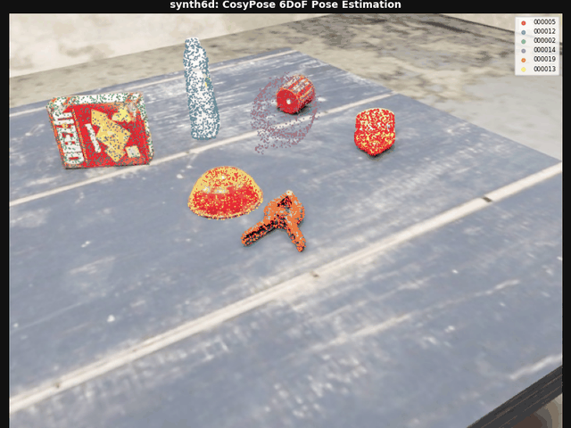
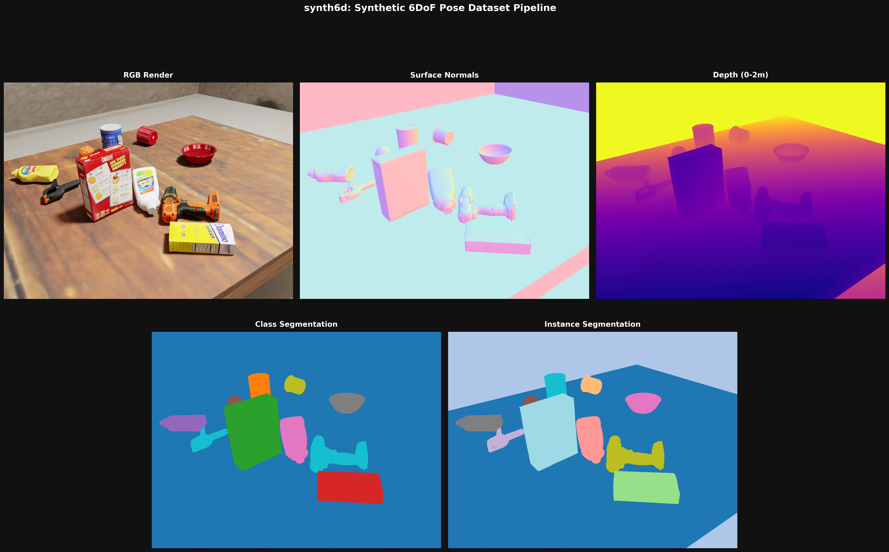
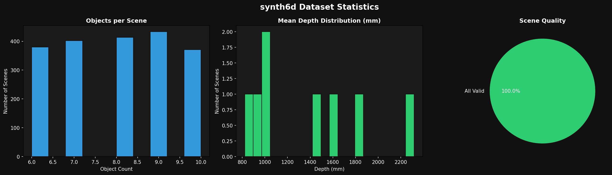
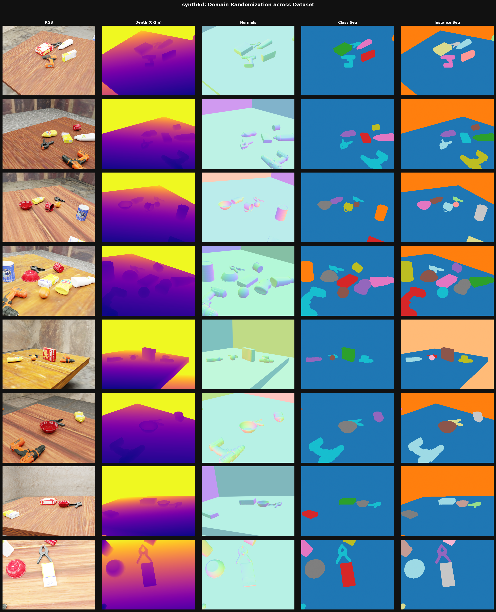
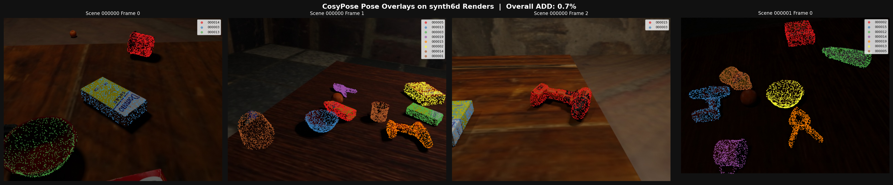

# synth6d

Physically-based synthetic data generation pipeline for 6DoF object pose estimation.
Built with **BlenderProc** + **Blender Cycles**. Generates fully annotated training data
with zero real images and zero manual labeling.



---

## What This Demonstrates

- End-to-end synthetic data pipeline: generation, annotation, validation, downstream evaluation
- Domain randomization for sim-to-real transfer: lighting, textures, materials, camera
- BOP format compliance verified with bop_toolkit
- 6DoF pose estimation evaluation (ADD/ADD-S) using CosyPose on synth6d renders

**Stack:** BlenderProc · Blender Cycles · YCB benchmark objects · Poly Haven PBR textures · CosyPose

---

## Overview

Each scene produces 5 synchronized outputs:
RGB render, surface normals, depth map, instance segmentation and class segmentation.

Objects are placed using Blender's rigid body physics simulation — they fall and
settle naturally, creating realistic occlusion and pose variety without manual placement.
Every scene independently randomizes lighting, wall/floor/table textures, object
material properties and camera position.



---

## Results

2000 fully annotated synthetic scenes generated with zero manual labeling, evaluated
downstream with a pretrained pose estimator on real BOP format output.

| Output | Details |
|--------|---------|
| Scenes | 2000 synthetic scenes, 100% valid |
| Objects | 10 YCB benchmark objects (google_16k meshes), 6-10 per scene |
| Annotations | RGB + depth + normals + instance/class segmentation + 6DoF poses |
| Format | HDF5 + BOP |
| Randomization | Lighting, wall/floor/table textures, material perturbation, camera |





---

## Downstream Validation: Choice of Pose Estimator

The initial roadmap targeted GDR-Net for training on synth6d data. In practice,
the reference implementation is pinned to an older CUDA toolchain and requires
compiling custom CUDA extensions, which made it impractical to set up on
available hardware and on Kaggle.

Rather than invest in porting that toolchain, I used **CosyPose** (via the
actively maintained **HappyPose** toolbox) for evaluation: it installs from
standard pip wheels, runs on modern CUDA, and integrates natively with the
BOP format this pipeline already outputs.

Because CosyPose's pretrained YCB-V models are themselves trained on
synthetic (PBR) data, running one on synth6d renders tests whether this
pipeline's domain-randomized output lands close enough to a real training
distribution to be usable. Training a model from scratch on synth6d data
is a natural next step.

### ADD Score Results

CosyPose evaluated zero-shot (no fine-tuning on synth6d) — the following
tests whether this pipeline's output is close enough to real training
distributions to be usable out of the box.

CosyPose evaluated on 24 synth6d frames (137 object instances) using
ground-truth bounding boxes, isolating pose estimation accuracy from
detection quality.

| Threshold | Correct / Total | Accuracy |
|-----------|-----------------|----------|
| ADD < 5% diameter  | 0 / 137   | 0.0%  |
| ADD < 10% diameter | 1 / 137   | 0.7%  |
| ADD < 20% diameter | 28 / 137  | 20.4% |
| ADD < 50% diameter | 105 / 137 | 76.6% |

The 76.6% at 50% diameter threshold shows the model produces geometrically
sound poses on synth6d renders. Mean translation error is roughly 5-13 cm
and the overlaid point clouds align well visually. The strict-threshold
accuracy is low for two reasons: ADD < 10% of diameter is an extremely
tight bar (about 1.25 cm for the mug), and CosyPose was trained on BOP's
own synthetic renders rather than synth6d. I confirmed this is a
distribution gap rather than a pipeline bug: predicted translations match
ground truth to within a few centimeters, and the errors are systematic
and reasonable rather than random. Symmetric objects (master_chef_can,
bowl) were evaluated with ADD-S.



---

## Setup

### 1. Install dependencies
```bash
pip install -r requirements.txt
```

### 2. Download YCB objects
Go to [ycb-benchmarks.s3-website-us-east-1.amazonaws.com](http://ycb-benchmarks.s3-website-us-east-1.amazonaws.com/)
and download the **16k laser scan** for each object listed in `configs/scene_config.yaml`.

Extract into `assets/objects/` with this structure:
```
assets/objects/
    006_mustard_bottle/
        google_16k/
            textured.obj
            textured.mtl
            texture_map.png
    025_mug/
    ...
```

### 3. Download textures
Download PBR textures from [Poly Haven](https://polyhaven.com/textures) at 1K resolution
and extract into `assets/textures/`. See `configs/scene_config.yaml` for the full list of
wall, floor and table texture pools currently used.

### 4. Run
```bash
blenderproc run src/generate_dataset.py
```

Edit `configs/scene_config.yaml` to change number of scenes, objects, render quality
and all other parameters. Keep `num_scenes: 3-5` for local testing.

For large runs (1000+ scenes) use Kaggle T4 GPU — see Kaggle Setup below.

### 5. Visualize output
```bash
blenderproc vis hdf5 output/hdf5/0.hdf5
```

Or use the visualization script for the full 5-panel pipeline image:
```bash
python scripts/visualize.py output/hdf5/0.hdf5
python scripts/visualize.py output/hdf5/4.hdf5 --out docs/sample_outputs/scene4.png
```

### 6. Validate dataset
```bash
python src/validator.py --bop_dir output/bop --hdf5_dir output/hdf5 --visualize
```

### 7. Merge multiple Kaggle runs
If you generate in batches across multiple sessions:
```bash
python scripts/merge_runs.py --runs_dir output --output_dir output/merged
```

### 8. Run pose estimation evaluation
See `notebooks/cosypose_eval.ipynb` for the full CosyPose evaluation pipeline
(Kaggle GPU notebook, reproducible end to end).

---

## Kaggle Setup

For generating 1000+ scenes, run on Kaggle T4 GPU:

1. Upload your project code, YCB objects and textures as separate Kaggle datasets
2. In the notebook, copy code and symlink assets then run:
```python
import os
os.chdir("/kaggle/working/synth6d")
os.environ["MPLBACKEND"] = "Agg"
!blenderproc run /kaggle/working/synth6d/src/generate_dataset.py
```
3. Update `configs/scene_config.yaml` for Kaggle: `use_only_cpu: false`, `num_scenes: 500`, `noise_threshold: 0.02`

---

## Project Structure

```
synth6d/
├── configs/
│   └── scene_config.yaml       # all tunable parameters
├── src/
│   ├── generate_dataset.py     # main generation loop
│   ├── scene_builder.py        # room, objects, camera, physics
│   ├── randomizer.py           # lighting, texture, material randomization
│   ├── utils.py                # config loading, path helpers, logging
│   └── validator.py            # dataset quality checks and statistics
├── scripts/
│   ├── visualize.py            # pipeline visualization grid
│   └── merge_runs.py           # merge multiple Kaggle run outputs
├── notebooks/
│   └── cosypose_eval.ipynb     # CosyPose evaluation on synth6d (Kaggle)
├── assets/
│   ├── objects/                # YCB .obj files (gitignored)
│   └── textures/               # Poly Haven textures (gitignored)
├── output/                     # generated dataset (gitignored)
└── docs/
    └── sample_outputs/         # sample renders for README
```

---

## Domain Randomization

Each scene independently randomizes:

| Property | Details |
|----------|---------|
| Lighting | Area light, random position, energy (5-25W), size and color temperature |
| Wall textures | 5 textures: brick, factory brick, concrete, stone, rock wall |
| Floor textures | 5 textures: asphalt, linoleum, slate, tiles, worn tile |
| Table textures | 5 textures: dark wood, black planks, worn wood, fine grain, wood table |
| Object materials | Roughness perturbed per object type, specular on metallic objects |
| Camera | Sphere sampling around scene POI, 0.6-1.5m distance, 0.3-0.8m height |
| Object placement | 60% upright, 40% random rotation; physics handles settling |

---

## Implementation Notes

A few non-obvious things worth documenting for anyone building something similar:

**Depth visualization requires clipping.**
BlenderProc depth maps store raw metric values in meters. The full range (0-5m+)
compresses nearby objects into a narrow band. Clipping to 0-2m gives useful contrast
for tabletop scenes. The raw values are preserved in the HDF5 file, clipping is
only applied at visualization time.

**Surface normals must be enabled after objects are loaded.**
Calling `enable_normals_output()` before any mesh exists in the scene results in
blank normal maps (all 0.5 values). The fix is to call renderer setup after the
first scene's objects and room are created. A `setup_renderer_done` flag ensures
it only runs once per session.

**Area lights instead of point lights in enclosed rooms.**
Point lights in a closed room cause severe overexposure because light bounces off
walls repeatedly. Area lights spread illumination over a surface and produce
natural soft shadows. Energy range 5-25W with random size (0.5-2.0m) gives
realistic variation between small lamp and large ceiling panel.

**YCB poisson meshes are incomplete.**
The `poisson/` folder in the YCB processed download contains meshes reconstructed
from RGB-D scans which often have holes. Use the `google_16k/` meshes from the
separate "16k laser scan" download, scanner-clean and complete. The pipeline
checks for google_16k first and falls back to poisson.

**BOP writer on Windows.**
The BOP writer has path separator issues on Windows and fails silently for most
scenes. HDF5 output works correctly on all platforms. Run BOP generation on
Kaggle (Linux) for full BOP output.

**On the GDR-Net method.**
Before choosing a downstream estimator, I worked through the GDR-Net paper
in depth: the dense 2D-3D coordinate map plus Patch-PnP design that replaces
the classic predict-correspondences-then-PnP/RANSAC pipeline with a single
differentiable CNN, the allocentric rotation and scale-invariant translation
parameterizations, and the symmetry-aware pose loss. That last part is what
informed treating master_chef_can and bowl with ADD-S instead of ADD in this
pipeline's evaluation.

---

## Roadmap

- [x] Project structure and config
- [x] Basic scene rendering: RGB, depth, normals, segmentation
- [x] Domain randomization: lighting, textures, material perturbation
- [x] BOP format output with 6DoF pose annotations
- [x] 2000 scene dataset generated (Kaggle T4 GPU)
- [x] Dataset validation and statistics
- [x] 6DoF pose estimation evaluation (CosyPose, ADD metric)
- [x] Pose estimation demo: animated GIF across synth6d scenes

---

## Open Questions / Suggestions Welcome

This is a learning project for synthetic data engineering.
If you work in this space and have thoughts on any of the following, I'd appreciate input:

- Is a simple tabletop YCB scene the right complexity for demonstrating a 6DoF pipeline,
  or would a more varied scene (bin picking, shelf arrangement) be more relevant?
- Any BlenderProc patterns that would make the randomization more effective for sim-to-real?
- Would fine-tuning CosyPose directly on synth6d data meaningfully close the domain gap,
  or is the bigger lever elsewhere (more scenes, more texture variety, lighting realism)?

---

## References

- [BlenderProc](https://github.com/DLR-RM/BlenderProc) - Denninger et al., RSS 2020
- [YCB Object and Model Set](http://ycb-benchmarks.s3-website-us-east-1.amazonaws.com/) - Calli et al., ICRA 2015
- [BOP Benchmark](https://bop.felk.cvut.cz/) - Hodaň et al., ECCV 2018
- [Poly Haven](https://polyhaven.com/) - CC0 PBR assets
- [GDR-Net](https://arxiv.org/abs/2102.12145) - Wang et al., CVPR 2021
- [CosyPose](https://arxiv.org/abs/2008.08465) / [HappyPose](https://github.com/agimus-project/happypose) - Labbé et al., ECCV 2020